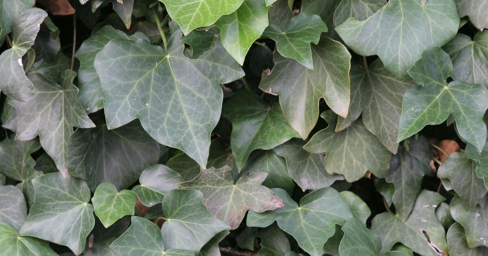
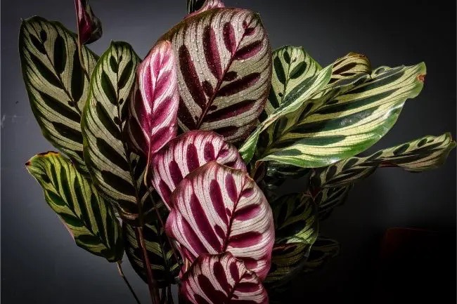

- # Hedera helix / English ivy
  tags:: [[🌱Flora]] 
  name:: English #[[ivy]]
  binomial:: [[Hedera Helix]]
  family:: #[[Araliaceae]]
  subfamily:: #[[NA]]
  kingdom:: #[[Plantae]]
  clade:: #[[Tracheophytes]] #[[Angiosperms]] #[[Eudicots]] #[[Asterids]] 
  order:: #[[Apiales]]
  genus:: #[[Hedera]]   
  substrate:: most soil types, but thrives in #[[sphagnum]] #[[peat moss]] #[[sand]] #[[welldrained]] 
  ph:: #[[ph6.0]]
  light:: #[[full sun]] to #[[partly shade]] 
  humidity:: #[[40%]] 
  temperature:: thrives in cold climate. Optimal: #[[10c]] - #[[18c]] / #[[50f]] - #[[65f]]
  npk-rating:: ?-?-?
  habitats:: #[[semiarid]] #[[mediterranean]] #[[europe]] #[[western asia]]   
  seasons:: #[[all-seasonal]]
  uses:: #[[aesthetics]] #[[medicinal]] #[[antiallergic]] #[[anti-inflammatory]] #[[ arthritis]] #[[antispasmodic]] 
  care:: #[[shade]] #[[partly shade]]
	- Notes:
		- A relatively forgiving and versatile plant.
		- Toxic to most mammals.
		- Skin irritant
		- Poisonous
		- Even if found to be both a skin irritant and poisonous, researchers has found the plant to give multiple beneficial properties in Ethanol tinctures.
		  Article: The Anti—inflammatory and Anti—arthritic Properties of Ethanol Extract of Hedera Helix
	- {:height 700, :width 600}
-
-
-
- # Geoppertia makoyana / Cathedral windows / Peacock plant
  tags:: #[[🌱Flora]]
  name:: Cathedral Windows, Peacock plant
  binomial:: #[[Goeppertia]] makoyana. (syn. #[[Calathea]] makoyana)
  family:: #[[Marantaceae]] ( #[[arrowrood]] ) 
  subfamily:: #[[NA]] 
  kingdom:: #[[plantae]]
  clade:: #[[Tracheophytes]] #[[Angiosperms]] #[[Monocots]] #[[Commelinids]]
  order:: #[[Zingiberales]] 
  genus:: #[[goeppertia]]
  substrate:: 50%potting soil, 20%#[[orchid bark]] (sub. gravel) 20%#[[charcoal]] 10%#[[perlite]] #[[welldrained]] #[[moist]] 
  ph:: #[[ph6.5]] #[[ph7]]
  light:: #[[indirect light]]
  humidity:: #[[60%]] 
  temperature:: #[[18c]] - #[[30c]] / #[[65f]] - #[[85f]]
  npk-rating:: 10,10,10 
  habitats:: #[[semiarid]] #[[eastern brazil]]
  seasons:: #[[NA]]
  uses:: #[[aesthetics]]
  care:: #[[bright]] #[[indirect light]] #[[humid]]
	- Notes:
		- Keep the soil a little moist, but bevare of root rot!
	- {:width 700, :height 600}
	  id:: 64145fe3-2ec5-4c71-8df4-aa17676be9d9
-
-
-