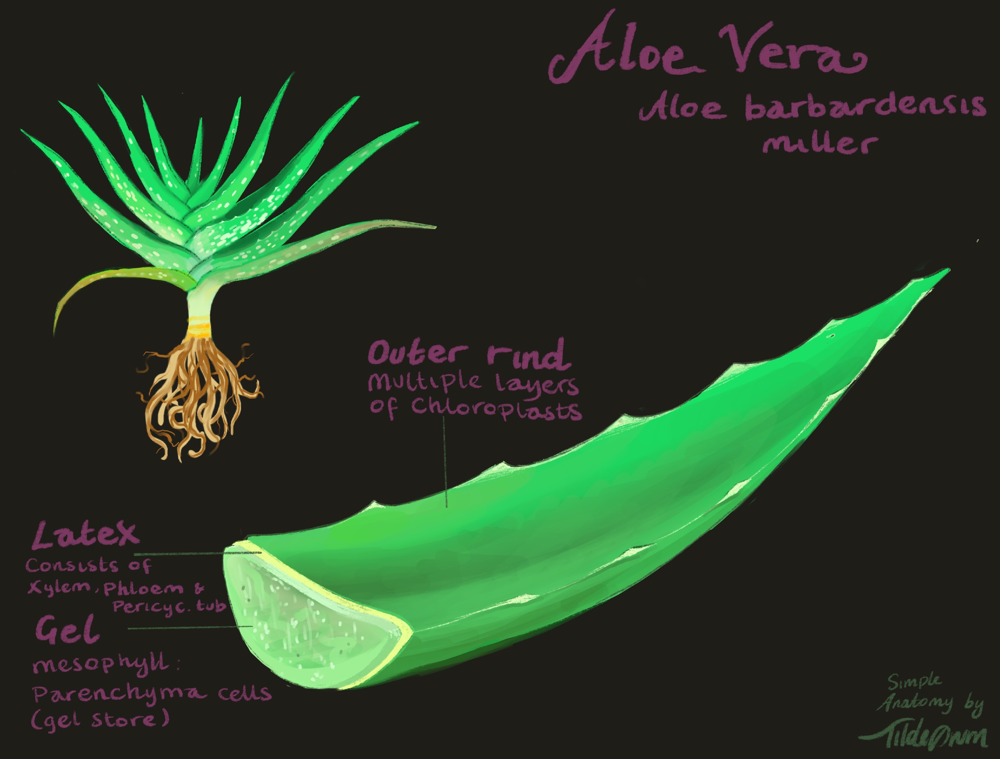
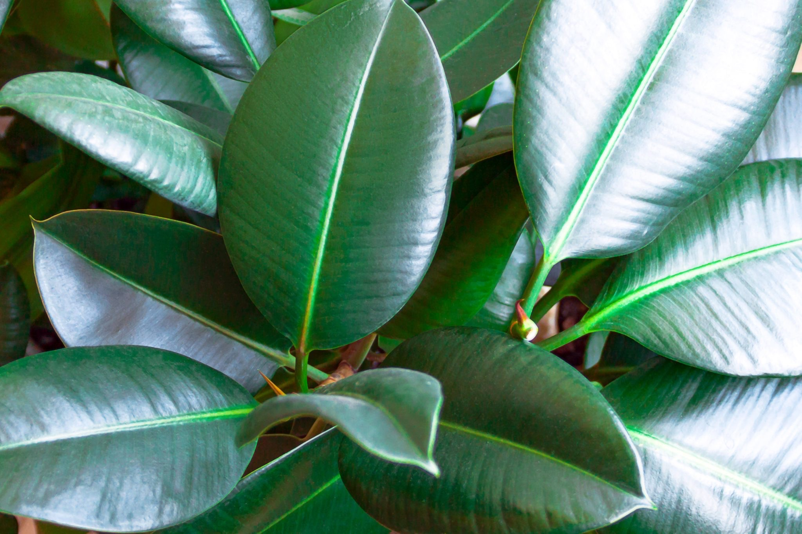

tags::  [[🌱Flora]] 
name::  #[[Aloe Vera]] 
binomial:: [[Aloe Barbadensis Miller]]
plant-type-tags:: #[[succulent]]
family:: #[[asphodelaceae]]
subfamily:: #[[NA]] 
kingdom:: #[[plantae]]
clade:: #[[NA]]
order:: #[[NA]]
genus:: #[[NA]]
maintenance:: #[[low maintenance]]
water-need:: #[[low water-need]]
substrate:: #[[peat moss]] #[[lava rock]] #[[pumice]] #[[bark]] #[[coir]] #[[hydrafiber]] #[[perlite]] #[[welldrained]]
ph:: #[[ph5.5]] - #[[7.5]]
npk-rating:: found npk recommendation ranging from 0.5,1,1 - 2,7,7 and all the way to 10,40,10… “sigh”  
light:: #[[full sun]] preferably 
humidity:: < #[[50%]] 
habitats::  #[[Arid climate]] 
seasons::  #[[NA]]   
uses::  #[[medicinal]] #[[antibacterial]] #[[anti-inflammatory]] #[[antimicrobal]] #[[antiviral]] #[[immunomodulating]] #[[constipation]] #[[lowers bloodsugar levels]] #[[skinburn]] #[[laxative]] #[[anticancer]]

	- Notes:
		- 🤲🏼Care:
			- A quite grateful plant that are easy to care for.
		- 🧪Uses:
			- For #[[wound healing]],  #[[sunburn]] or 2nd degree skin burn, the gel can be applied so that the skin may find relief and can focus on healing. Maybe because of its #[[anti-inflammatory]] and #[[antibacterial]] properties.
			- #[[Periodontitis]] is a dental affliction that results in sore, swollen, bleeding and/or recedings in the gums. Aleo Vera mouth was are used for treatment in relief or partly regeneration.
			- I cant find a single research paper concluding Aloe Vera gel being somewhat a health risk
		- ‼️Caution:
			- Do not consume or use part of the latex(second layer) from Aloe Vera.
			  High dosage of the latex can be unsafe and in some cases lethal. May cause kidney failure.
			- While some parts of the plant has proven beneficial, studies suggest that “whole leaf extract“ may have #[[tumor-promoting]] effects.
	- 
	-
-
- tags::  [[🌱Flora]] 
  name::  [[Rubber Fig]]
  binomial:: #[[Ficus elastica]]
  family:: #[[moraceae]] #[[mulberry family]] 
  subfamily:: #[[NA]] 
  kingdom:: #[[plantae]]
  clade:: #[[Tracheophytes]] #[[Angiosperms]] #[[Eudicots]]
  order:: #[[Rosales]]
  genus:: #[[Ficus]]
  sub-genus:: [[F. Subg. Urostigma]]
  maintenance:: #[[low maintenance]]
  water-need:: #[[low water-need]] #[[medium water-need]]
  substrate:: #[[peaty]] #[[pine bark]] #[[bark]] #[[coarse sand]] (or perlite) #[[well-aerated]] #[[welldrained]]
  ph:: #[[ph5.5]] - #[[ph7.5]]
  npk-rating:: when mature: 24,8,16
  light:: #[[shade]] #[[indirect light]] #[[partly shade]]
  humidity:: #[[50%]]
  temperature:: #[[55c]] #[[131f]]
  habitats::  #[[tropic]]
  seasons::  #[[NA]]   
  uses::  #[[aesthetics]] #[[toxic]]
	- Notes:
		- 🤲🏼Care:
		- A forgiving plant that allows dry soil in shorter periods of time.
		- 💧Watering:
			- Water when dry or when slightly damn. Let soil dry in periods.
		- Can irritate skin. Avoid contact with open wounds.
		- Can grow up to 30 meters tall but will need support.
		- Fun fact: The roots are formed in order to build living bridges in India.
	- 
	-
-
-