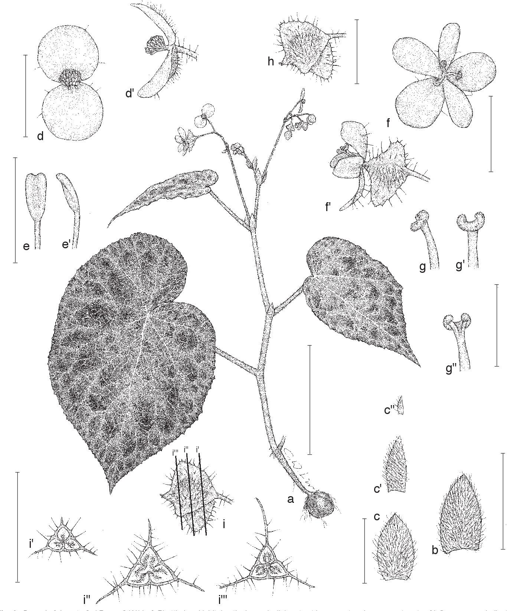
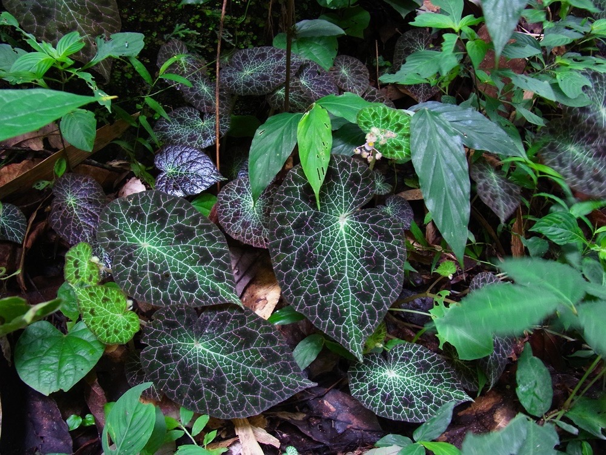
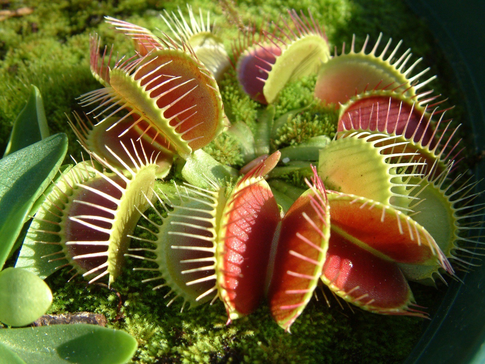
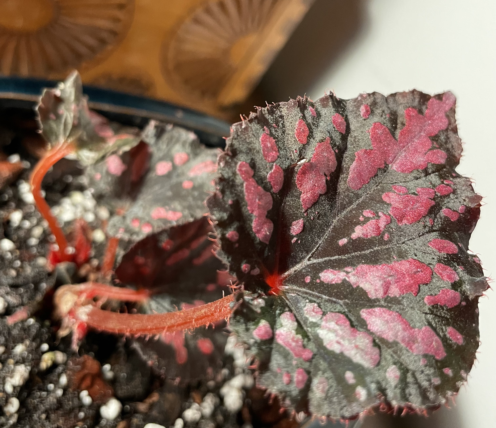
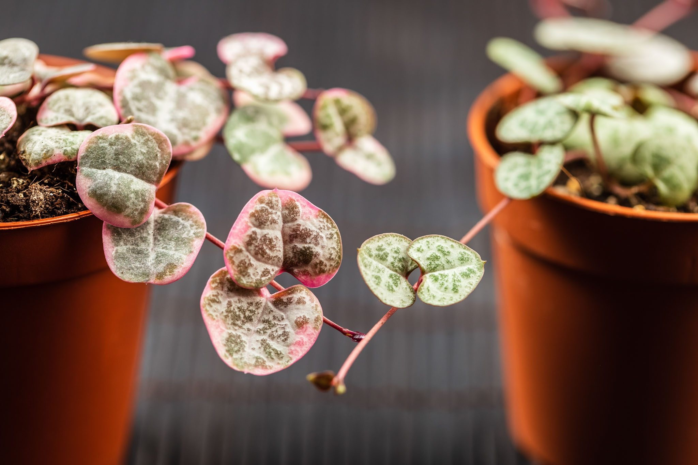
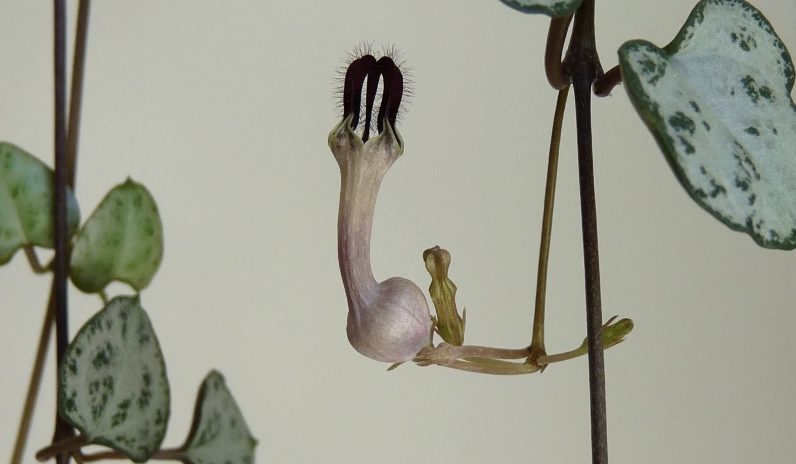

- # Begonia fulgurata / Lightning strike begonia 
  tags::  [[🌱Flora]] 
  name:: [[begonia]] lightning strike 
  binomial:: Begonia fulgirata
  family:: #[[begoniaceae]]
  subfamily:: #[[NA]]
  genus:: #[[NA]] 
  kingdom:: #[[plantae]]
  clade:: #[[NA]]
  order:: #[[NA]]
  substrate:: #[[karst limestone]] #[[chalk]] substitute: #[[mineral based]] 50%< #[[organic components]]
  ph:: #[[ph6.0]] #[[ph7.5]]
  npk-rating:: 10,10,10 (blooming begonias will need about 10-30-20)
  light:: #[[partly shade]] 
  humidity:: #[[NA]] 
  temperature:: #[[19c]] - #[[24c]] 
  habitats::  #[[tropical]] #[[northern Thailand]] #[[Chiang Mai]] #[[specialized]] #[[endangered]] 
  seasons::  #[[NA]]   
  uses::  #[[medicinal]] #[[chinese medicine]] 
  care::  #[[welldrained]] #[[moist]] #[[advanced care]]
	- Notes:
		- 🤲🏼Care:
			- 💧Watering:
			- When soil surface is dry to the touch.
			- Don’t overwater when flowering, will result in root rot.
			- 💤Dormancy: 
			  Care for tubers (from cultivators):
			- “After finishing cleaning the tubers, give them a couple hours to dry i na place with good air flow. Put on latex gloves, put tuber on paper plate and give a wee sulfur dusting. 
			  Toss tubers and dry potting mix in closed bag. (label name & date). Then plant tubers after 3 months”
			- Cycle to imitate dry season over 3 months: moist -> medium -> low.
			- ‼️Temperature is an important factor! Look above.
	- {:height 700, :width 600}
	- {:height 700, :width 600}
-
- #Dioaea muscipula / Venus flytrap
  tags::  [[🌱Flora]] 
  name:: [[Venus flytrap]]
  binomial:: Dioaea muscipula
  family:: #[[droseraceae]]
  subfamily:: #[[NA]]
  genus:: #[[Dionaea]] 
  kingdom:: #[[plantae]]
  clade:: #[[Tracheophytes]] #[[Angiosperms]] #[[Eudicots]]
  order:: #[[Caryopyllales]]
  maintenance:: #[[high maintenance]]
  water-need:: #[[high water-need]] 
  substrate:: #[[sandy]] #[[sphagnum]] #[[peat moss]] #[[perlite]] #[[peaty]] #[[nutrient poor]] 
  ph:: #[[ph3.5]] #[[ph5.0]]
  light:: #[[full sun]] min. 6 hours but 10 hours is optimal.  
  humidity:: #[[50%]] > 
  temperature:: -7c / 20f - 37c / 100f
  npk-rating:: No fertilizing of plant if beginner. Bugs only! One and maximum  of two every few weeks.  
  dormant:: yes
  habitats::  #[[sandhills]] #[[coastal plains ]] #[[east north-america]] 
  seasons:: #[[NA]]   
  uses::  #[[aesthetics]] #[[medicinal]] #[[anti-bacterial]] #[[anti-fungal]] #[[anti-parasitic]]
	- Notes:
		- 🤲🏼Care:
			- 🪰Feeding:
				- Prefers bugs as mineral & nutrition source only.
			- 💧Watering:
				- 2 - 4 days in room temperate environment.
				- Water when soil is damp or slightly moist.
				- Tip: pinch soil - if water emerges, it is too wet.
			- 🪴Potting:
				- Pots should be tall or just big for its roots to grow.
				- Glazed ceramic pots only (unglazed might leak unwanted minerals)
			- 💤Dormancy:
				- Needs a dormant period for about 3 months (less water to no water). If the outside climate are corresponding to its habitats, leave outside, preferably in a basement or garage - preferably a bit of light and treated with fungicide and wrapped in sphagnum to prevent fungi growth. Check regularity.
					- Don’t mistake it for a dying plant in these periods just because it looses its leafs.
	- {:height 700, :width 600}
-
-
- # Begonia Rex-cuntorum
  tags:: [[🌱Flora]] 
  name:: Begonia Rex-cultorum 
  binomial:: Begonia Rex-cultorum
  family:: #[[begoniaceae]] 
  subfamily:: #[[NA]]
  kingdom:: #[[plantae]]  
  clade:: #[[Tracheophytes]] #[[Angiosperms]] #[[Eudicots]] #[[Rosids]] 
  order:: #[[Cucurbitales]]
  genus:: #[[Begonia]]
  maintenance:: medium to low if requirements are withheld 
  water-need:: #[[medium water-need]]
  substrate:: #[[porous]] #[[peat moss]] #[[peaty]] #[[perlite]] #[[coir]] 
  ph:: #[[ph5.7]] - #[[ph6.2]]
  npk-rating:: #[[20,20,20]]   
  light:: #[[partly shade]]
  humidity:: #[[50%]] > 
  temperature:: 18c / 65f - 24c / 75f
  habitats::  #[[subtropical]] #[[humid]] #[[india]] #[[southern china]]
  dormant::  yes 
  uses::  #[[aesthetics]]
	- Notes:
		- Care: #[[rex]] begonias will (as it is a cultivated plant from the smae species) need same soil, npk and other care conditions)
		- 💧Watering:
			- Water when soil surface feels dry to the touch.
		- 💤Dormancy:
		- Needs dormant period. Less water and no fertiliser in 2-3 months.
		-
		- The image below shows the “painted leaf begonia”
	- {:height 700, :width 600}
-
-
- # Ceropegia woodii f. variegata / String of hearts 
  tags::  [[🌱Flora]] 
  name:: [[String of hearts]] [[Rosary vine]]
  binomial:: #[[Ceropegia woodii f. variegata]] 
  plant-type-tags:: #[[epilithic]]
  family:: #[[apocynaceae]]
  subfamily:: #[[NA]]
  genus:: #[[NA]] 
  kingdom:: #[[plantae]]
  clade:: #[[NA]]
  order:: #[[NA]]
  substrate:: #[[welldrained]] will grow in #[[rock]] cracks. #[[peat moss]] 
  ph:: #[[ph6.0]] 
  habitats::  #[[South Africa]] #[[Eswatini]] #[[Zimbabwe]] #[[stone hillside]]    
  seasons::  #[[NA]]
  uses::  #[[medicinal]] 
  care::  #[[filtered light]] #[[indirect light]]
	- Notes:
		- Water when soil is dry.
	- {:height 700, :width 600}
- {:height 700, :width 600}
-
-
-