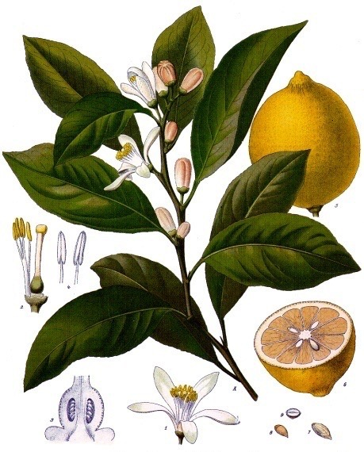
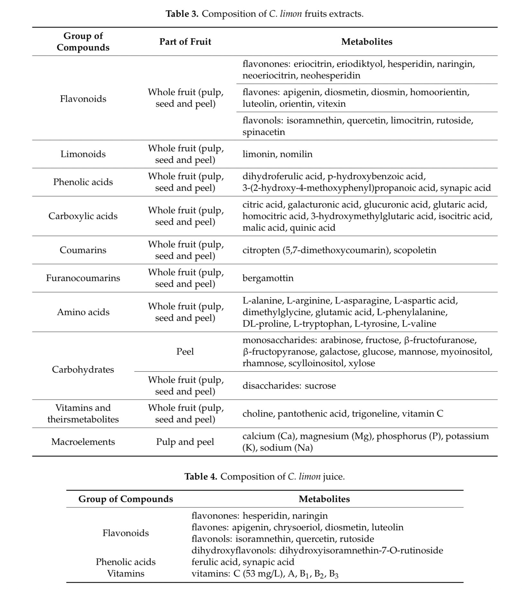

- Citrus limon / Lisbon lemon
  tags::  [[🌱Flora]]
  name:: [[Lisbon Lemons]]
  binomial:: #[[Citrus Limon]]
  family:: #[[Rutaceae]]
  subfamily:: #[[NA]] 
  kingdom:: #[[plantae]]
  clade:: #[[Tracheophytes]] #[[Angiosperms]] #[[Eudicots]] #[[Rosids]]
  order:: #[[Sapindales]]
  genus:: #[[Citrus]] 
  substrate:: #[[sandy]] #[[welldrained]]
  ph:: #[[ph6.0]] - #[[ph7.5]]
  light:: #[[full sun]] 
  humidity:: 
  temperature:: min 7c / 45f
  npk-rating:: 6,6,6
  habitats::  #[[tropic]] #[[subtropical]]
  dormant:: no 
  uses::  #[[medicinal]]
	- Notes:
		- 🤲🏼Care:
			- If heavy soil is used, it will need quality compost and gypsum.
			- If soil is acidic, add lime to achieve preferred pH.
			- 6 hours of sun is optimal.
			- Be cautious if the air is dry and with little to no air circulation. It will cause leaves to burn and wither.
		- 🧪Usage:
			- Leafs can be used for tea
			- Care stuff or Medicinal properties
		- ☝🏼Tips:
			- For best fruit yield - the height should be around 2 meters.
			- Third year might produce fruits.
	-
	- Anatomy
	- {:height 700, :width 600}
	- Metabolites:
	- {:height 700, :width 600}
	-
- Research paper:
  [Citrus limon (Lemon) Phenomenon—A Review of the Chemistry, Pharmacological Properties, Applications in the Modern Pharmaceutical, Food, and Cosmetics Industries, and Biotechnological Studies](https://www.researchgate.net/publication/338735661_Citrus_limon_Lemon_Phenomenon-A_Review_of_the_Chemistry_Pharmacological_Properties_Applications_in_the_Modern_Pharmaceutical_Food_and_Cosmetics_Industries_and_Biotechnological_Studies)
-