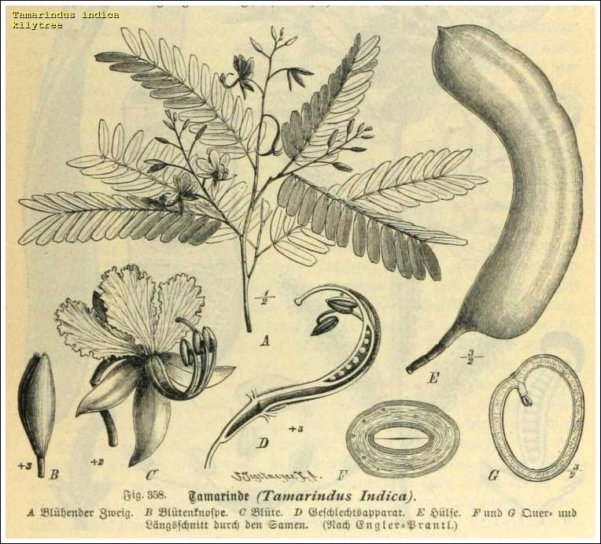
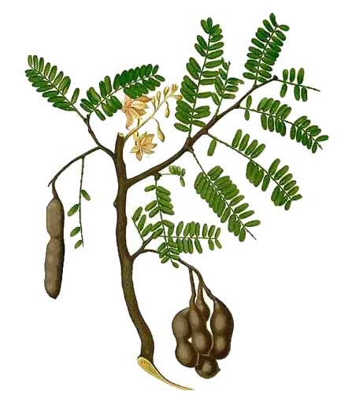
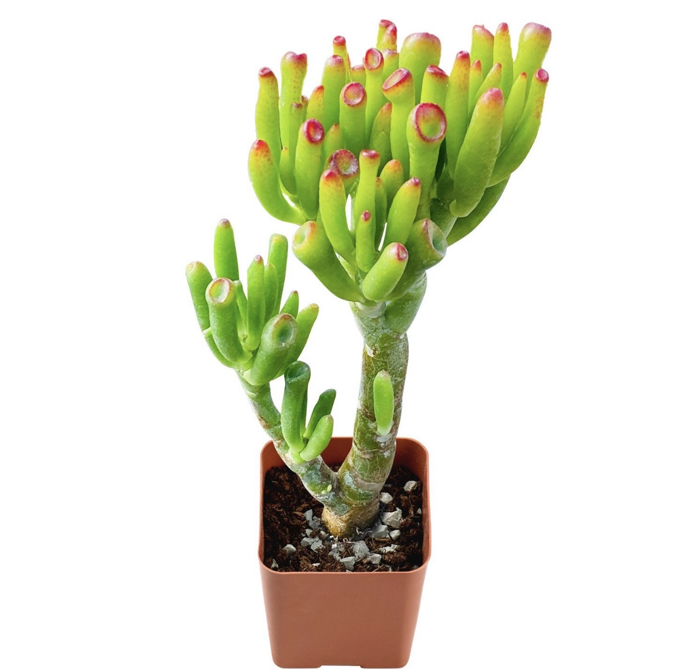
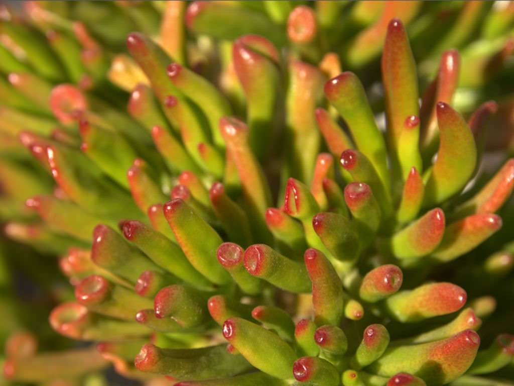
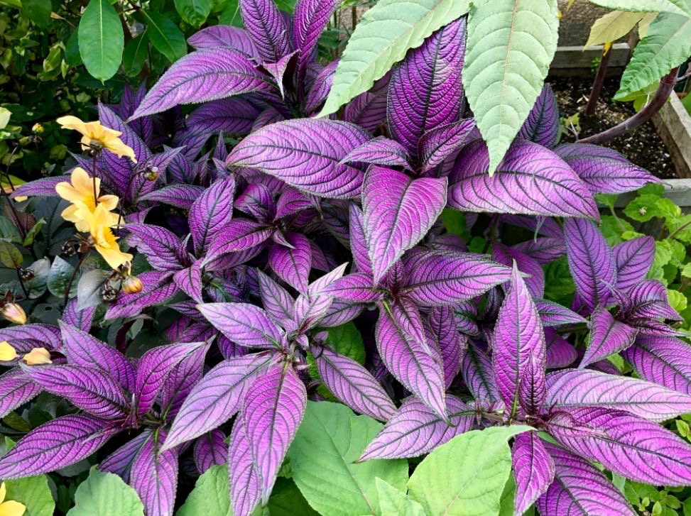
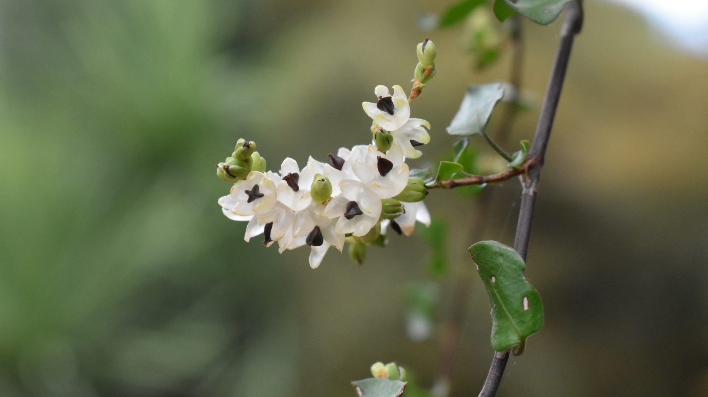
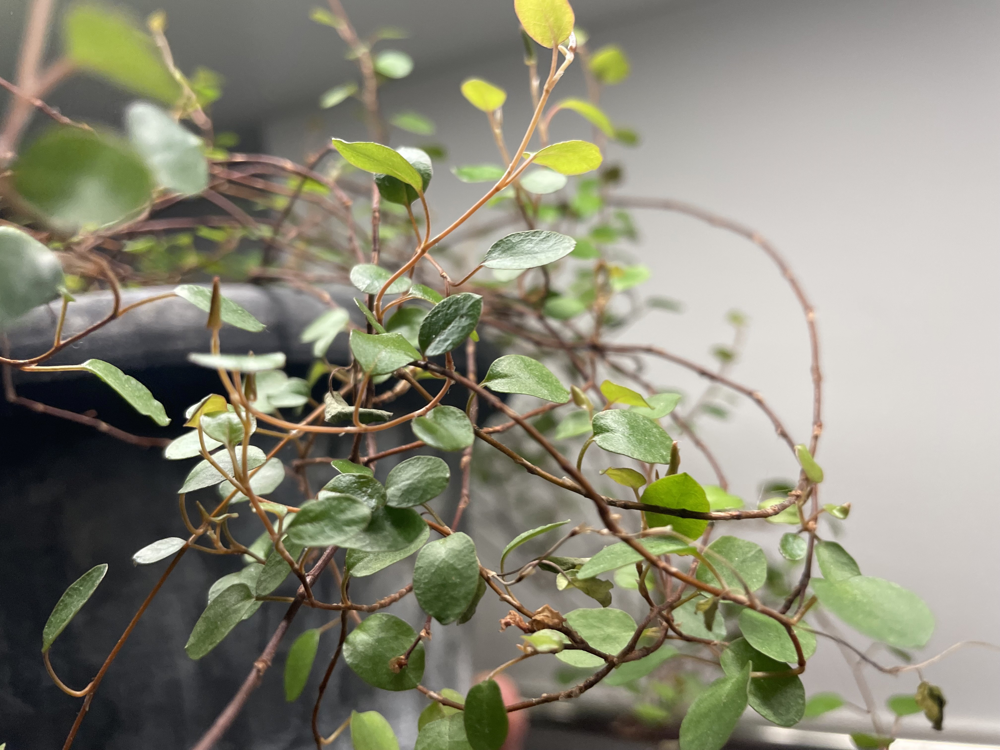

tags::  [[🌱Flora]]
name:: [[Tamarind]]
binomial:: [[Tamarindus indica]]
family:: #[[Fabaceae]]
subfamily:: #[[Detarioideae]]
tribe:: #[[Amherstieae]] 
kingdom:: #[[plantae]]
clade:: #[[Tracheophytes]] #[[Angiosperms]] #[[Eudicots]] #[[Rosids]]
order:: #[[Fabales]]
genus:: #[[Tamarindus L.]] 
substrate:: #[[clay]] #[[loam]] #[[sand]] #[[acidic soil]] #[[welldrained]]
ph:: #[[ph5.5]] - #[[ph6.8]]
light:: #[[full sun]]
humidity:: low
temperature:: #[[7c]] #[[45f]]
npk-rating:: young: #[[6,6,3]]. old: #[[8,3,9]] (occasionally)
habitats::  #[[subtropical]] #[[tropic]] #[[Africa]] #[[India]]. Dry and windy areas
dormant:: ?  
seasons::  #[[NA]] 
uses::  #[[medicinal]] #[[food]] #[[antibacterial]] #[[hepatoprotective]] #[[anti-venom]]

	- Notes:
		- 🤲🏼Care:
			- The tree likes a dry, warm and windy climate and prefers a clay, sandy, loamy but welldrained substrate.
			- Be aware of pests such as: scales, belay bugs, aphids and fluid borers.
		- 🧪Uses:
			- Food:
				- Fruits used fresh and dried and can be used for juices, sauces, jams.
				- The taste resembles lemon, but without the sour “edge”.
			- Medicinal:
				- Extracts of tamarind “inhibited the major hydrologic enzymes of early envenomation(local tissue damage, inflammation, hypotension”
	- 
	- 
- Link:
	- [Sampalok : Philippine medicinal plants ](http://www.stuartxchange.org/Sampalok.html)
-
-
-
- tags::  [[🌱Flora]]
  name:: [[Jade fingers]] [[Skinny fingers]]
  binomial:: #[[Crassula ovata ‘Gollum’]]
  family:: #[[Crassulaceae]] Jade plant family
  subfamily:: #[[NA]] 
  kingdom:: #[[plantae]]
  clade:: #[[Tracheophytes]] #[[Angiosperms]] #[[Eudicots]] 
  order:: #[[Saxifragales]]
  genus:: #[[Crassula]] 
  substrate:: #[[gritty soil mix]] #[[turface]] #[[granite]] #[[pine bark]] #[[welldrained]]
  ph:: #[[ph6.0]]
  light:: #[[full sun]]
  humidity:: low
  temperature:: high / room temp. Can tolerate light frost.
  npk-rating:: #[[10,20,10]] (nitrogen, phosphorus, potassium)
  habitats::  #[[Arid climate]] #[[semiarid]] #[[South Africa]]
  dormant:: in winter   
  seasons::  #[[NA]] 
  uses::  #[[food]] #[[medicinal]]
	- Notes:
		- 🤲🏼Care:
	-
		- 🧪Uses:
			- In Southern Africa the roots are a traditional food source.
			- Roots can be grated cooked and are eaten with thick milk.
			- The leaves are said to be used (cooked in milk) as remedy for diarrhoea(diarrhea???); epilepsy, and corns, and used as a purgative
			- [Data sheet of Crassula ovata(jade plant) by Andrew P. ](https://www.cabidigitallibrary.org/doi/10.1079/cabicompendium.113574)
	-
	- 
	- 
-
- tags::  [[🌱Flora]]
  name:: [[Persian shield]]
  binomial:: #[[Strobilanthes Dyeriana]]
  plant-type-tags:: #[[purple]] 
  family:: #[[Acanthaceae]]
  subfamily:: #[[NA]] 
  kingdom:: #[[plantae]]
  clade:: #[[Tracheophytes]] #[[Angiosperms]] #[[Eudicots]] #[[Asterids]] 
  order:: #[[Lamiales]]
  genus:: #[[Strobilanthes]] 
  substrate:: #[[houseplant soil]] #[[potting soil]] #[[perlite]] #[[peat moss]] #[[welldrained]]
  ph:: #[[ph5.5]] #[[ph7.5]]
  light:: #[[full sun]] #[[partly shade]] 6 hours of full sun, then partly sun.  
  humidity:: 
  temperature:: min #[[15c]] #[[60f]] 
  npk-rating:: “Diluted half-strength balanced liquid fertilizer” (15,15,15 or 7,7,7???) 
  habitats::  #[[tropic]] #[[subtropical]] #[[Myanmar]]
  dormant:: yes
  seasons::  #[[NA]] 
  uses::  #[[medicinal]]
	- Notes:
		- 🤲🏼Care:
			- Potting mix should be rich on organic matter. Keep neutral to acidic.
			- Fertilize every 2 months from spring to summer.
	-
		- 🧪Uses:
	- 
-
-
- tags::  [[🌱Flora]]
  name:: [[Pohueuhe]] [[Maidenhair vine]]
  binomial:: #[[Muehlenbeckia complexa]]
  plant-type-tags:: #[[vine]] 
  family:: #[[Polygonaceae]]
  subfamily:: #[[NA]] 
  kingdom:: #[[plantae]]
  clade:: #[[Tracheophytes]] #[[Angiosperms]] #[[Eudicots]] 
  order:: #[[Caryopyllales]]
  genus:: #[[Muehlenbeckia]] 
  substrate:: Most soil types works. light: #[[sand]], medium: #[[loam]], heavy #[[clay]] #[[welldrained]]
  ph:: mild acidic, neutral and mildly alkaline soils - but unknown Specific pH.  
  npk-rating:: #[[3,0,4]] but only found from one crappy [source](https://www.plantsimple.dk/plantsimpleindex/muehlenbeckia-complexa). 
  light:: #[[partly shade]] #[[full sun]] 
  humidity:: 30 - 40%
  temperature:: #[[15c]] #[[60f]] - #[[24c]] #[[75f]]  
  habitats:: #[[New Zealand]] #[[Light woodland]]
  dormant:: yes  
  seasons::  #[[NA]] 
  uses::  #[[food]] #[[aesthetics]]
	- Notes:
		- 🤲🏼Care:
	-
		- 🧪Uses:
			- The small transparent flower looking fruits can be eaten and are sweet.
	- 
	- 
	-
-