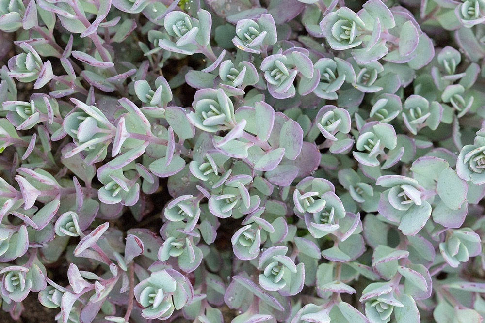
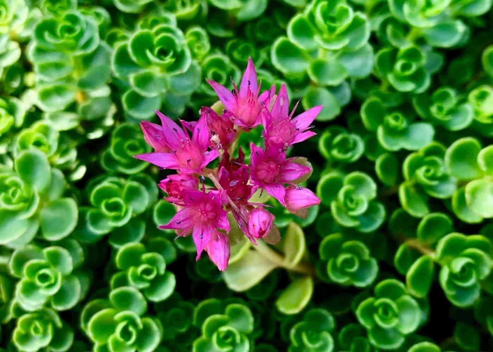

- # Sedum cauticola 'lidakense' / Cliff stonecrop 'lidakense'
  tags::  [[🌱Flora]]
  name:: [[Cliff stonecrop ‘lidakense’]]
  binomial:: #[[Sedum cauticola ‘lidakense’]]
  plant-type-tags:: #[[cactus]] #[[succulent]] #[[perennial]]  
  family:: #[[Crassulaceae]] #[[Stonecrobs]]
  subfamily:: #[[Sempervivoideae]] 
  kingdom:: #[[plantae]]
  clade:: #[[Tracheophytes]] #[[Angiosperms]] #[[Eudicots]] 
  order:: #[[Saxifragales]]
  genus:: #[[Sedum L.]] 
  maintenance:: #[[low maintenance]] 
  water-need:: #[[low water-need]] 
  substrate:: #[[chalk]] #[[loam]] #[[sand]] #[[welldrained]]
  ph:: #[[ph6.0]] #[[ph8.0]] neutral to #[[alkaline]] soils 
  npk-rating:: 5,5,5 all-purpose fertilizer 
  light:: #[[full sun]]
  humidity:: #[[30% humidity]] #[[50% humidity]]
  temperature:: can tolerate quite low temperatures 
  habitats::  #[[North hemisphere]] but can extent further South.
  dormant:: #[[NA]]  
  seasons::  #[[NA]] 
  uses::  #[[aesthetics]]
	- Notes:
		- 🤲🏼Care:
			- Easy to care for. If grown in garden, little to no fertilizer is needed.
	-
		- 🧪Uses:
			- Some types of the sedum plant have medicinal purposes, but this plants medicinal properties are unfortunately unknown.
	- {:height 700, :width 600}
	- {:height 700, :width 600}
	-