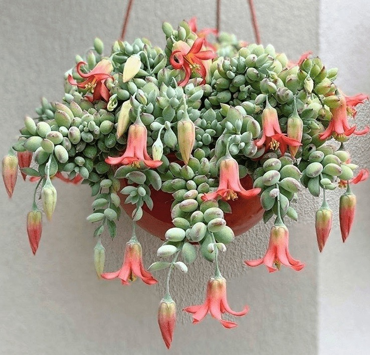
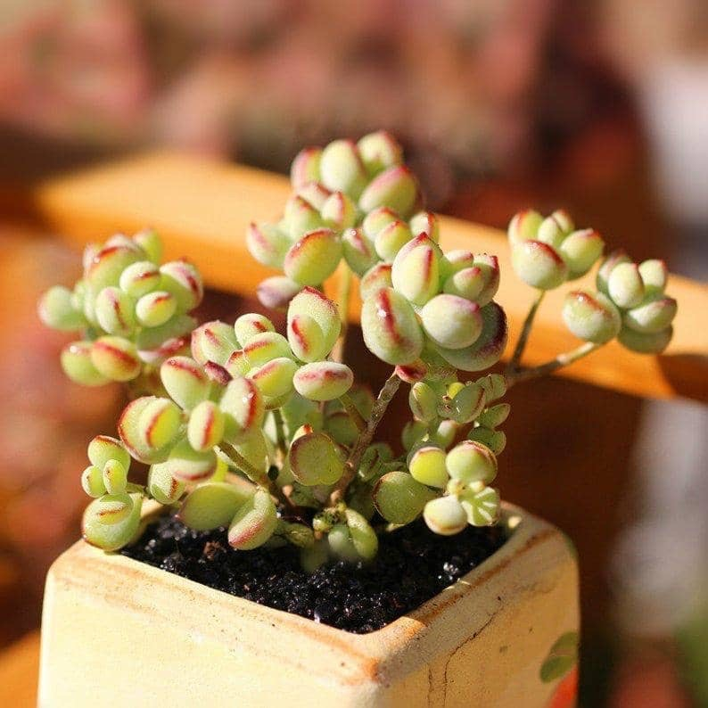
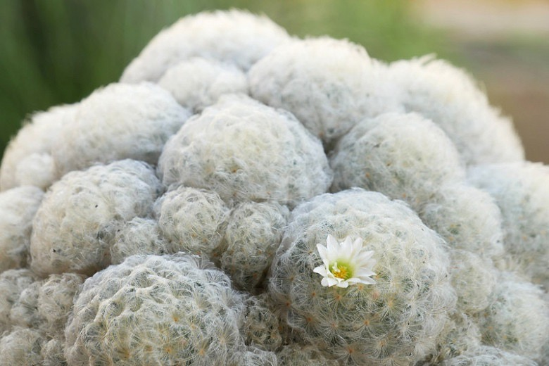
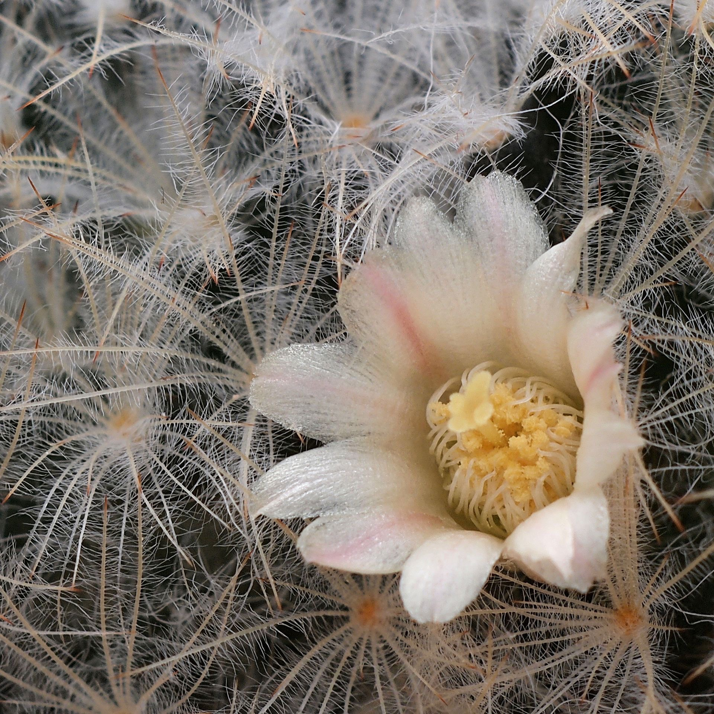
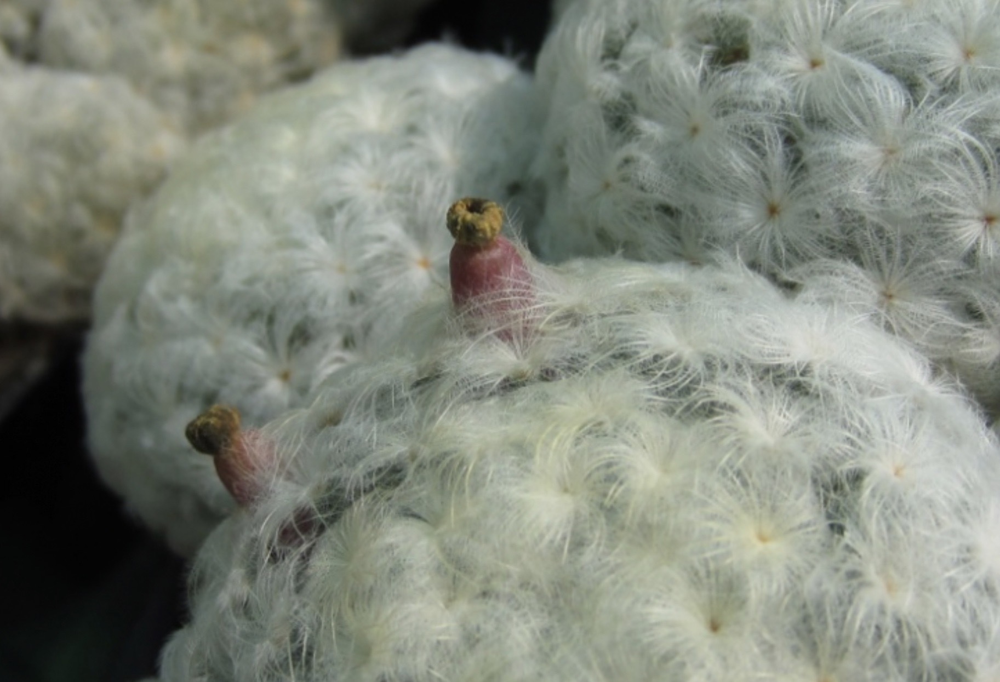

- # Cotyledon pendens / Cliff cotyledon
  tags::  [[🌱Flora]]
  name:: [[Cliff cotyledon]] 
  binomial:: #[[Cotyledon Pendens]]
  plant-type-tags:: #[[succulent]] #[[campanulate]] #[[perennial]] #[[epilithic]]
  family:: #[[Crassulaceae]]
  subfamily:: #[[Kalanchoideae]] (???) 
  kingdom:: #[[plantae]]
  clade:: #[[Tracheophytes]] #[[Angiosperms]] #[[Eudicots]]
  order:: #[[Saxifragales]] ???
  genus:: #[[Cotyledon]]
  maintenance:: #[[low maintenance]]
  water-need:: #[[low water-need]]
  substrate:: #[[porous]] #[[sand]] #[[perlite]] #[[potting soil]] #[[welldrained]]
  ph:: #[[ph5.5]] (Information from general succulent ph values)
  npk-rating:: #[[5,10,10]]. (Information from general succulent npk ratings)
  light:: #[[full sun]] preferably 
  humidity:: < #[[50%]] 
  temperature:: #[[55c]] #[[131f]]
  habitats::  #[[semiarid]] #[[subtropical]] #[[South Africa]]
  dormant:: yes  
  seasons::  #[[NA]] 
  uses:: #[[toxic]] , at least to most animals.
	-
	- Notes:
		- 🤲🏼Care:
			- 💧Watering:
			- In summer, water every 6-8 days.
			- In winther, every 15-20 days. 
			  If grown indoor, a recommendation would be to squeeze leafs in order to check the pressure. 
			  High pressure = low water need and vice versa. (Or if soil if completely dry throughly)
		- 🧃Fertilizing:
			- The plant will need little fertilizing, and when significant reduction in growth.
		- 🌞Sun:
			- Should be exposed to plenty sun (with no ventilation, sunburn may occur)
			- Leaf drop might be an indication of low sun.
		- 🪳Disease and pests:
			- Some will claim its susceptible by scales, spider mites, mealy and sucking pests.
			- while others claim its not prone, be sure to check your plants once in a while for infestations.
	-
		- 🧪Uses:
			- None known, apart from the aesthetic or visual appeal.
	- {:height 700, :width 600}
	- {:height 700, :width 600}
-
-
- # Mammillaria plumosa / Feather cactus
  tags::  [[🌱Flora]]
  name:: [[Feather cactus]] [[Fluff cactus]]
  binomial:: #[[Mammillaria plumosa]]
  plant-type-tags:: #[[cactus]] #[[succulent]]
  family:: #[[Cactaceae]]
  subfamily:: #[[Cactoideae]] 
  kingdom:: #[[plantae]]
  clade:: #[[Tracheophytes]] #[[Angiosperms]] #[[Eudicots]]
  order:: #[[Caryopyllales]]
  genus:: #[[Mammillaria]]
  maintenance:: #[[low maintenance]]
  water-need:: #[[low water-need]]
  substrate:: #[[non-organic soil]] #[[pumice]] #[[grit]] #[[sand]] #[[gritty soil mix]] #[[welldrained]]
  ph:: #[[ph6.0]] - #[[ph7.5]]
  npk-rating:: 5,10,10 diluted to 1/4th strength in growing season.  
  light:: #[[full sun]] always preferable, but can survive in #[[partly shade]] 
  humidity:: low
  temperature:: can withstand high temperatures.
  habitats::  #[[Arid climate]]
  dormant:: yes  
  seasons::  #[[NA]] 
  uses:: #[[food]] such as fruit?
	-
	- Notes:
		- 🤲🏼Care:
			- 🪳Pests:
			- Proper lighting and air circulation results in little to no pest problem.
			- When overwatered, mealybugs might begin infestations. (Apply insecticidal soap for removal)
			- 🧃Fertilizer:
			- Apart from requirements above, slow-release fertilizer can be applied Once a year in spring.
			- All purpose fertilizer diluted in 1/4th strength twice a year in spring and midsummer is durable as well.
			- 🪴Repotting:
			- Slow growing plants will not need repotting often. Only when outgrowing current pot.
			- 💧Watering:
			- During drought or hot summers, water regularity (~5-8 days) but it depends on climate conditions or if planted outside.
			- During wither, ~10days - 2 weeks. If planted outside and completely dormant, some will skip watering until beginning of spring.
	-
		- 🧪Uses:
			- Carries fruit, in which should be edible.
- {:height 700, :width 600}
- {:height 700, :width 600}
- {:height 700, :width 600}
-