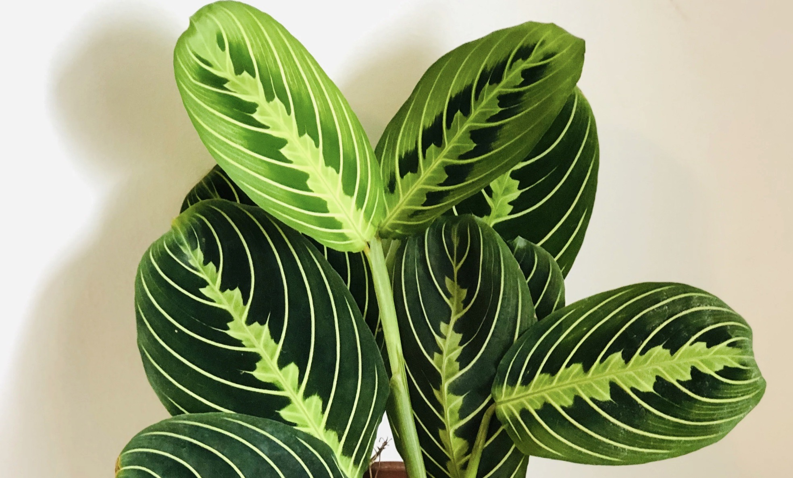

tags::  [[🌱Flora]]
name:: [[Prayer plant]] 
binomial:: #[[Maranta leuconeura]]
plant-type-tags:: #[[tropical perennial]] #[[Low-growing]] 
family:: #[[Marantaceae]]
subfamily::  
kingdom:: #[[plantae]]
clade:: #[[Tracheophytes]] #[[Angiosperms]] #[[Monocots]]
order:: #[[Zingiberales]]
genus:: #[[Maranta leuconeura]]
maintenance:: #[[low maintenance]]
water-need:: #[[medium water-need]]
substrate:: #[[tropical potting soil]] #[[loamy soil]] #[[sphagnum]] #[[peat moss]] #[[peat]] #[[perlite]] #[[welldrained]]
ph:: #[[ph6.0]] 
npk-rating:: 10,10,10 diluted in half strength (more details, see below)
light:: #[[shade]] #[[indirect light]] 
humidity:: #[[60%]] >  
temperature:: Min. #[[15c]] #[[59f]]
habitats::  #[[tropic]]
dormant:: yes  
seasons::  #[[NA]] 
uses::

	-
	- Notes:
		- 🤲🏼Care:
		- 💧Watering:
			- Water frequently during growing season. This is done when the soil surface is dry.
			- ‼️It is very important to never let the soil dry out.
			- ‼️It is also important to not let the soil get soggy, AND avoid letting water stay on the leafs. They are prone to rot if they get wet for too long.
			- Use lukewarm water when watering the plant.
		- 🪴Soil composition and potting:
			- Use #[[tropical potting soil]]
			- Many sites suggest different soil compositions. The type of soil mix suggested here is just suggestion. It is just essential for the soil to be a #[[peaty soil]] type, hold moist and have proper drainage.
			- It is important that drainage is well thought of. To ensure extra good drainage, add gravel/rocks in the bottom of the pot and make sure the pot has large and ample holes.
		- 🧃Fertilizer:
			- Add fertilizer every two weeks between early spring through fall. 
			  Only add fertilizer once a month through winter.
		- 💤Dormancy:
			- In winter, the plant might wither or loose a lot of leaves.
			- In order to help plant growth, give the plant a bit more light than usual. (not full sun)
		- ☝🏼Tips:
			- The plant will appreciate a humid environment. Place on tray with stone and water or preferably, place a humidifier next to these types of plants.
	-
		- 🧪Uses:
	- 
	- 
-
-
-