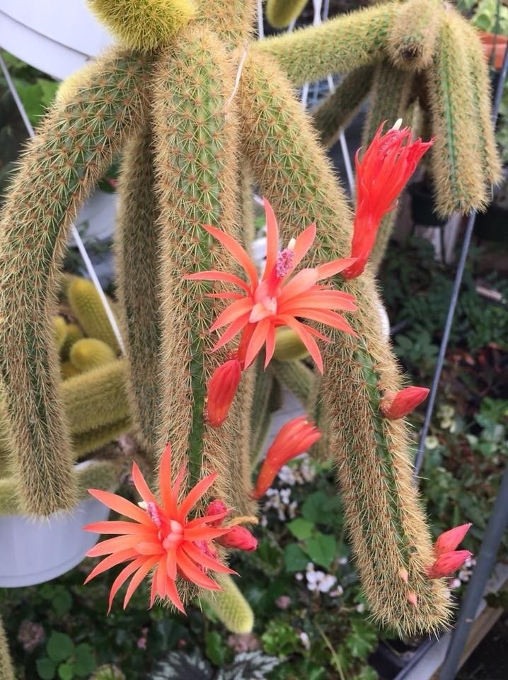

tags::  [[🌱Flora]]
name:: [[Golden rat tail]]
binomial:: #[[Cleistocactus winteri]]
plant-type-tags:: #[[cactus]] #[[succulent]] #[[epilithic]]
family:: #[[Cactaceae]]
subfamily:: #[[Cactoideae]] 
kingdom:: #[[plantae]]
clade:: #[[Tracheophytes]] #[[Angiosperms]] #[[Eudicots]]
order:: #[[Caryopyllales]]
genus:: #[[Cleistocactus]]
propagation:: yes
maintenance:: #[[low maintenance]] depending on the surrounding climate. 
water-need:: #[[low water-need]] #[[medium water-need]]
substrate:: #[[cactus potting soil]] #[[grit]] / #[[coarse sand]] / #[[gravel]] #[[perlite]] #[[pine bark]] #[[welldrained]]
ph:: #[[ph5.0]] #[[ph6.0]]
npk-rating:: 5,10,5  
light:: #[[full sun]]
humidity:: < #[[40%]]
temperature:: min. #[[7c]] / #[[45f]] - #[[32c]] / #[[90f]]
habitats::  #[[bolivia]] USDA hardiness zone 9 - 11  
dormant:: yes  
seasons::  #[[NA]] 
uses::  #[[medicinal]]

	-
	- Notes:
		- 🤲🏼Care:
		- Too much humidity can cause root rot, especially during wither.
		- 💧Watering:
			- In contrast to most cacti, the golden rat tail needs a more frequent watering in late spring through summer.
			- Keep soil moist, but not soggy.
			- In wither and fall, water when soil is completely dry.
		- 🧃Fertilizer:
			- 5,10,5 / cactus liquid fertilizer diluted to about half strength once every two weeks from late spring to summer.
		- 🪴Soil composition and potting:
			- Optimal cactus mix: Gravel mixed with #[[cactus potting soil]].
			- The cactus thrives in most soils, as long as it is oxygen rich soils. Make sure to “poke” wholes in the soil once every 3/4 months.
			- Repotting once every couple of years in cactus soil.
			- Choose bigger pots only if a bigger plant is wanted.
		- 🗡️Propagation:
			- Any part of the stem can be used.
			- Let the part dry a few day before repotting into soil.
			- Keep the top part moist (preferably with a mister)
	-
		- 🧪Uses: unknown
	- 
	- 
-
-
- tags::  [[🌱Flora]]
  name:: [[Monkeys tail]]
  binomial:: #[[Cleistocactus colademononis]]
  plant-type-tags:: #[[cactus]] #[[succulent]] #[[epilithic]]
  family:: #[[Cactaceae]]
  subfamily:: #[[Cactoideae]] 
  kingdom:: #[[plantae]]
  clade:: #[[Tracheophytes]] #[[Angiosperms]] #[[Eudicots]]
  order:: #[[Caryopyllales]]
  genus:: #[[Cleistocactus]]
  propagation:: [[yes]]
  maintenance:: #[[low maintenance]]
  water-need:: #[[low water need]]
  substrate:: #[[cactus potting soil]] #[[perlite]] #[[grit]] #[[sand]] #[[welldrained]]
  ph:: #[[ph6.0]]
  npk-rating:: 5,6,5 
  light:: #[[indirect light]] is ideal but tolerates #[[full sun]]
  humidity:: < #[[40%]]
  temperature:: min. #[[7c]] #[[44f]] max. ??
  habitats::  #[[desert]] #[[Mexico]] USDA hardiness zone 9-11 
  dormant:: yes
  seasons::  #[[NA]] 
  uses::  #[[aesthetics]] #[[toxic]]
	-
	- Notes:
		- 🤲🏼Care:
		- 💧Watering:
			- In winter the cactus should be “deep” watered once every 6-8 weeks.
			- In spring, gradually increase frequency of watering.
			- In summer, water only when soil feels dry.
		- 🪴Soil composition and potting:
			- Make sure to choose very well draining soil mix such as #[[cactus potting soil]] and a little extra #[[gritty]], and oxygen rich in consistency.
		- 🌞Sun:
			- Although it is a cacti, this type is prone to sunburns (Afternoon sun with no aeration). Therefore indirect sun is ideal.
		- ☝🏽Traits:
			- The fur/hair will show after 2-3 years.
	-
		- 🧪Uses: unknown
	- 
	- 
	- 
	-
	-