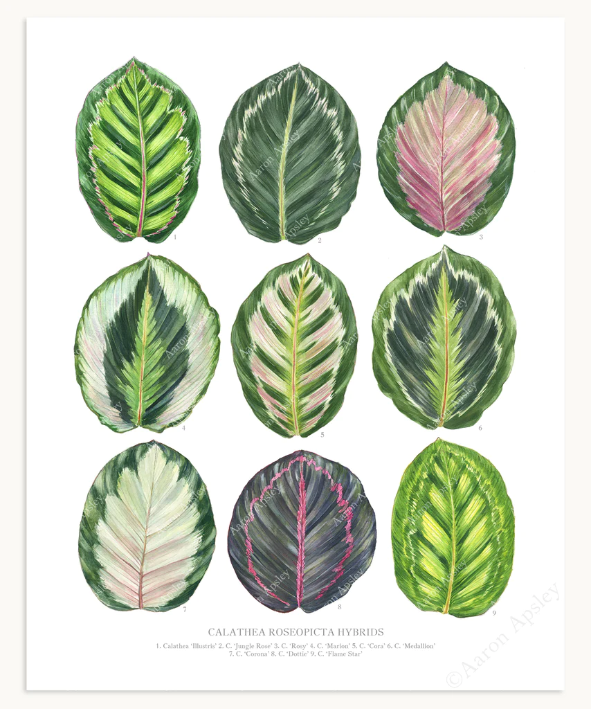

- # Calathea / Prayer plants
  tags:: [[🌱Flora]]
  genus:: #[[Calathea]]
  also-called:: [[Prayer plant]] [[Peacock plant]] [[Raddlesnake plant]] 
  genus-type-tags:: #[[flowering plants]] #[[Angiosperms]] #[[Angiosmerae]]
  number-of-species:: ~60 
  species-examples:: #[[Calathea/roseopicta]] #[[Calathea/ornata]] #[[Calathea/utilis]] #[[Calathea/orbifolia]]
  species-categories:: 
  kingdom:: #[[plantae]]
  clade:: #[[Tracheophytes]] #[[Angiosperms]]#[[Monocots]]
  order:: #[[Zingiberales]]
  family:: #[[Marantaceae]]
  subfamily:: 
  tribe::
  sub-tribe::
  propagation:: yes
  maintenance:: #[[medium maintenance]]
  water-need:: #[[high water need]]
  substrate:: #[[tropical potting soil]] #[[orchid bark]] #[[gravel]] #[[coco choir]] #[[pumice]] #[[perlite]] #[[organic potting mix]]
  ph:: #[[ph6.5]]
  npk-rating:: 10,10,10
  light:: #[[indirect light]]
  humidity:: #[[50%]] > 
  temperature:: #[[55c]] #[[131f]]
  habitats::  #[[tropic]] #[[South America]] #[[Latin America]] 
  dormant:: yes
	- Notes:
		- Be careful not to compare this plant with the genus #[[Goeppertia]] (As i have done multiple times)
		- The #[[Calathea]] is a tropical plant that thrives in the bottom of high density forests in. These conditions might be hard to maintain in common households and the this genus will need extra care and attention if one wants to avoid scorched marks and/or dried leaves.
		- Many Calathea on the marked might be cultivars but most sepcies will need the same care.
		-
	- 🌞Sun:
		- It is important that the plants gets bright but indirect sunlight. Just a couple of hours in dry climates plus bright direct sunlight will be sure to leave marks on the leaves.
		-
	- 💧Watering and humidity:
		- In spring and summer, water the plants frequently and keep the soil moist(but not wet) as this plant will need a lot of water in these seasons. If in doubt, pinch the soil. If the soil almost squeezes out a drop, the soil humidity is perfect.
		- In fall and winter, limit the watering until the soil is dry in the top layers of the soil. Limiting watering in these seasons prevents root rot.
		-
	- 🧃Fertiliser:
		- fertilise in growing season (spring and summer). Mix a 10,10,10 fertiliser and water each other weeks. Water only when soil is wet in advance!
		- Standard houseplant fertiliser will work as well if specialised npk ratings aren't met.
		-
	- 🪴Soil composition and potting:
		- The #[[tropical potting soil]] is recommended for most tropical plants.
		- The key factors that the soil needs for this genus and species are:
			- The ability to maintain moist - #[[coco choir]]
			- Well draining properties - #[[perlite]] or #[[gravel]]
			- Rich in organic matter - #[[worm castings]] or #[[organic potting mix]]
			-
	- 🗡️Propagation:
		- In spring, divide leaf clusters and re pot them.
		- Leaf cutting will not work.
		-
	- 💤Dormancy:
		- Will need a dormancy period where sun and watering are limited.
		-
	- 🧪Uses:
		- Some species of this plant have edible roots such as #[[Calathea allouia]]. But it might be categorised as the species #[[Goeppertia]]
	-
	- 📜References and links:
		- [Calathea Production Guide](https://mrec.ifas.ufl.edu/foliage/folnotes/calathea.htm)
		- [A Guide to Calathea Soil](https://www.plantsforallseasons.co.uk/blogs/calathea-care/a-guide-to-calathea-soil)
		- [How to Grow and Care for Calathea](https://www.thespruce.com/grow-calathea-indoors-1902745)
		- [Tips for calathea care in autumn - winter](https://be.green/en/blog/top-tips-calathea-care-in-autumn-winter)
		-
	- Image:
	- Calathea Roseopicta
	- {:height 700, :width 600}
	- Calathea orbifolia
	- {:height 700, :width 600}
	- Calathea ornata
	- {:height 700, :width 600}