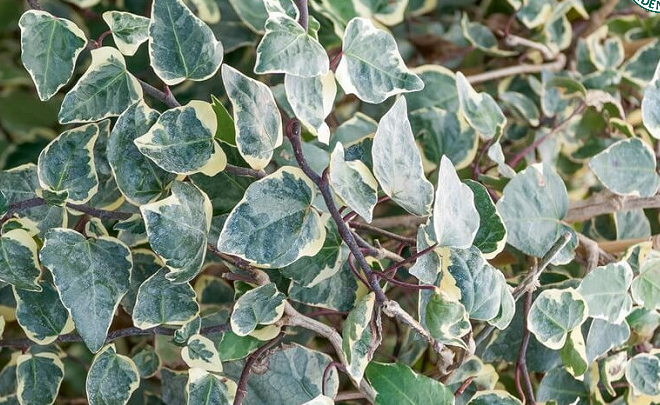

- ## Anatomy description:
- Stems are reddish and partly covered with scale-like hair.
- The leaf shape is ovate/oval-rhombic i shape and therefor has almost entire margins and smooth teeth.
-
- Leaf shape:
- {:height 500, :width 500}