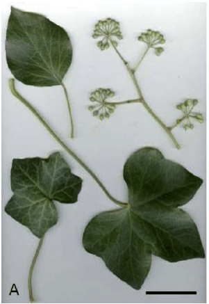
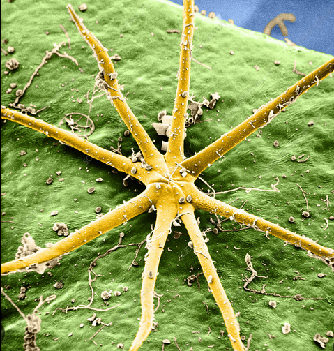

## Anatomy description:
- The leaft of the hibernica are different in shape depending on the leaf position(it's purpose). Young leaft and leafs that have the "creeping" ability have more "teehty" margins, while older leafs or leafs of the flowering part is oval/entire in its margins.
- The stem are green but turns light grey when bark is emerging.
-
- Leaf:
- 
- [Image link - Hedera crebrescens (Araliaceae) a newly identified diploid taxon...](https://www.researchgate.net/figure/Morphological-variability-of-leaves-of-Hedera-hibernica-A-leaf-on-the-creeping-shoot_fig7_321971453)
- Stellate hair:
- {:height 400, :width 400}
- [Image link](https://www.google.com/url?sa=i&url=https%3A%2F%2Fwww.sciencephoto.com%2Fmedia%2F710742%2Fview%2Fstellate-hair-on-hedra-helix-leaf-sem-&psig=AOvVaw2IS3lg2AfXe5PHejHnC2fn&ust=1679160075339000&source=images&cd=vfe&ved=0CBAQjRxqFwoTCNDOxfC84_0CFQAAAAAdAAAAABAE)