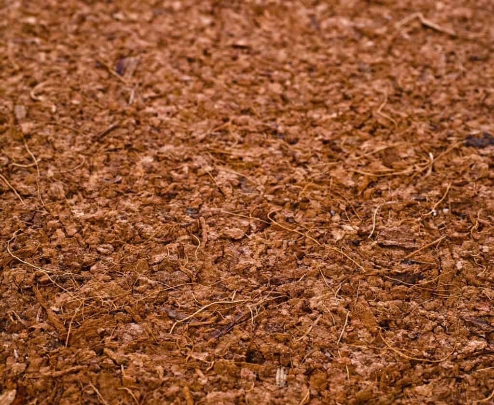

- Description:
	- Coco choir also referred as coconut fiber is made from the husk of the outer layer of the coconut.
- Advantages:
	- Excellent water retention properties which means less watering.
	  It also has good drainage properties.
- Disadvantages:
	- Can contain high amounts of salt.
	- Some places might not sell this product.
	- Can be har to regulate PH while using coco choir.
	- Contains almost no nutrients.
-
- Picture:
- 
-