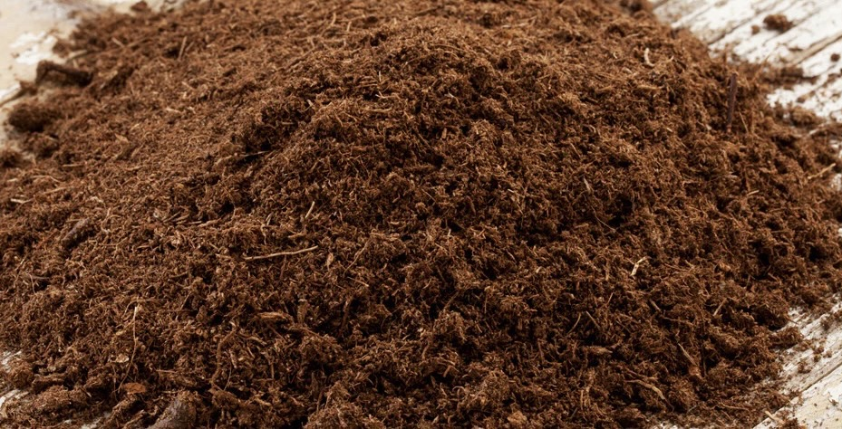

- Description:
	- Peat moss is derived from broken down #[[sphagnum moss]]. It also contains other partially decayed organic substances. It is quite acidic with a pH between 3.0 and 4.0.
	  Peat moss soil contents can vary depending on brand and on where the soil is produced.
-
- Advantages:
	- Can recuse pH levels in alkaline(acidic) soils.
	- Good water absorbent qualities and retains water for a long time.
	- Prevents soil compaction/caking.
	- Can prevent nutrients from leaching out too quickly.
-
- Disadvantages:
	- Poor in nutrients and minerals.
	- Too acidic for some plants.
- [Link for more.](https://lawnlove.com/blog/peat-moss-pros-and-cons/)
-
- Picture
- 
-