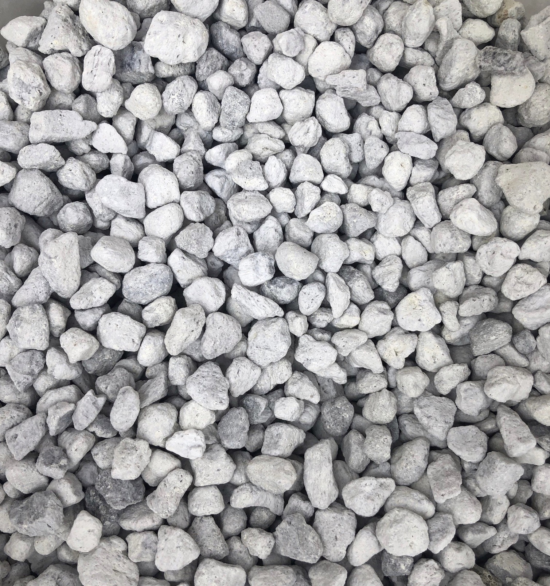

- Description:
	- Pumice also called pumicite, is derived from volcanic rock and are vesicular(low density/contains many small or big holes) and are rough texture. Pumice is primarily made of Silicon Dioxide and Aluminum Oxide.
- Advantages:
	- Well draining properties.
	- Creates airy soil.
- Disadvantages:
	- One page claims that pumice contains salt because it’s derived from volcanic rocks.
	  [Link](https://www.botanicare.com/hydro-101/pumice/)
-
- Picture:
- 
-